# Healthcare Application

In the current era, healthcare services are increasingly leveraging digital platforms to provide convenient and accessible solutions to patients. This application presents the development and implementation of a comprehensive healthcare platform designed to streamline various aspects of medical care.

## Key Features

- **Appointment Booking**: Easily schedule video consultations with healthcare providers.
- **Prescription Scanning**: Convert prescriptions into text format for easy reference and record-keeping.
- **Location-Based Services**: Utilize Google Maps integration to find nearby healthcare facilities and services.
- **Personalized Recommendations**: Receive tailored suggestions based on user feedback and preferences.
- **AI-Powered Chatbot**: Get immediate assistance and support through an intelligent chatbot.

This application aims to enhance the healthcare experience by making it more efficient and user-friendly.

## Application Screenshots

  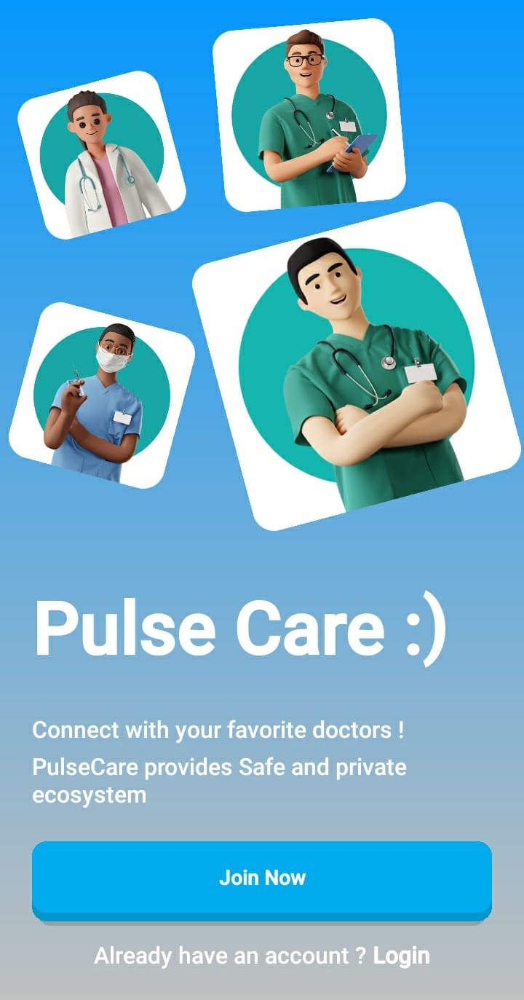
  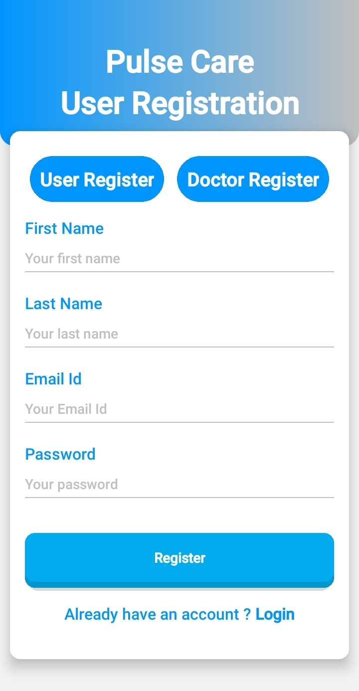
  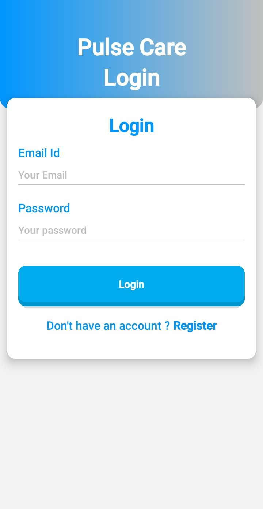

  Welcome Screen | User Registration | Login Screen

  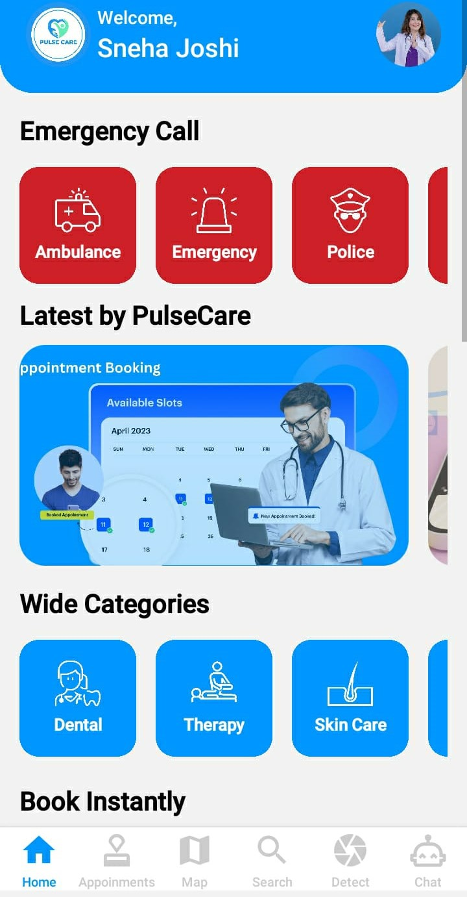
  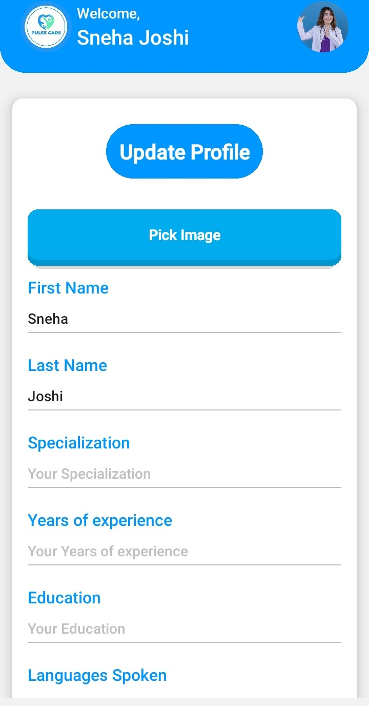
  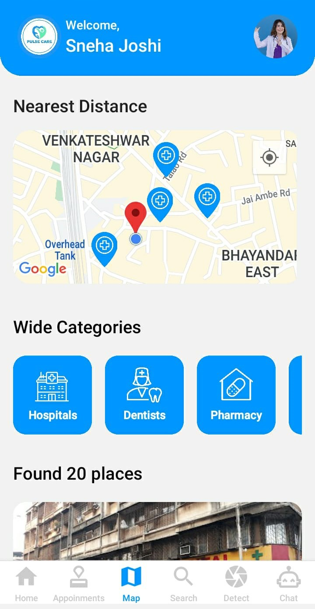

  Home Page | Update Profile | Map Main

  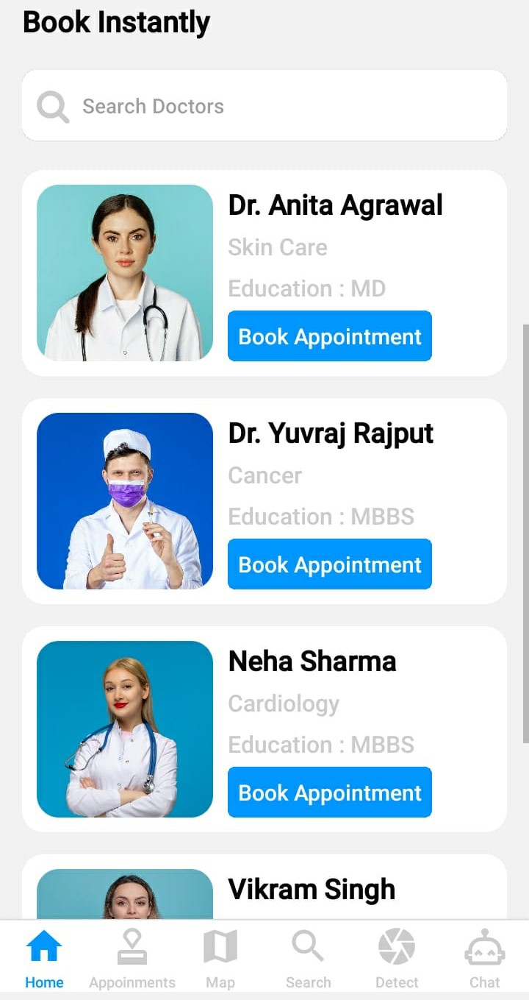
  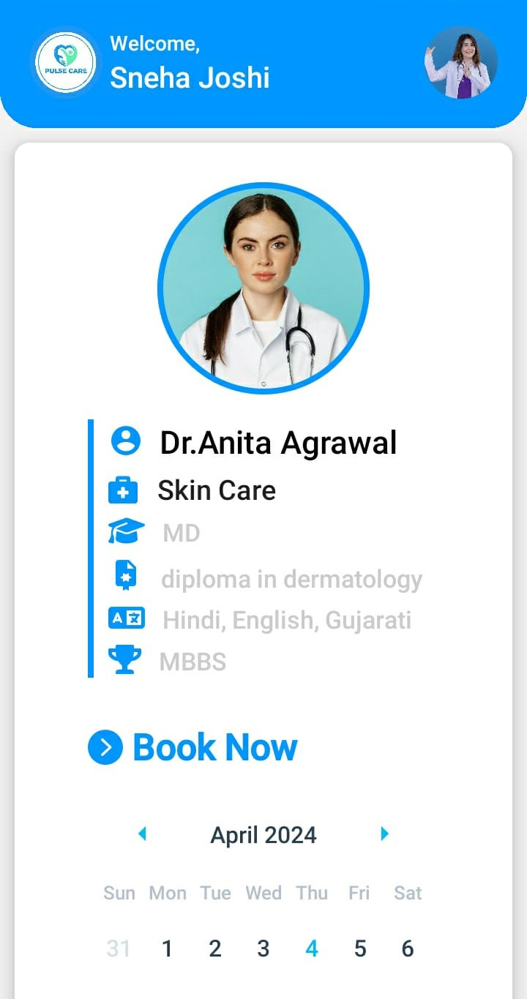
  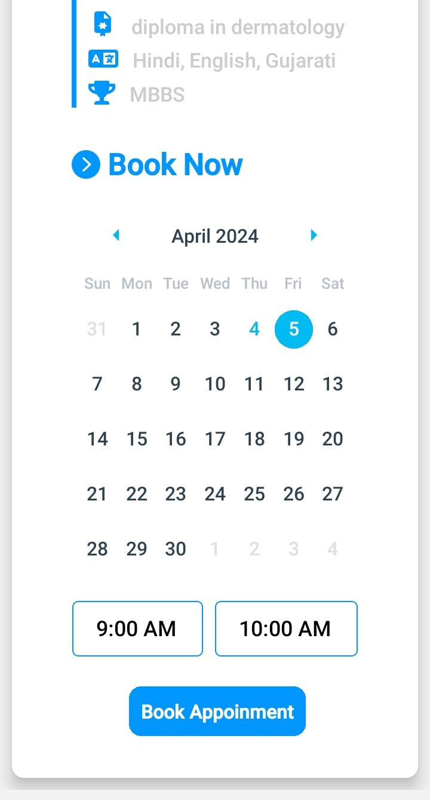

  Doctor List | Doctor Details | Appointment

  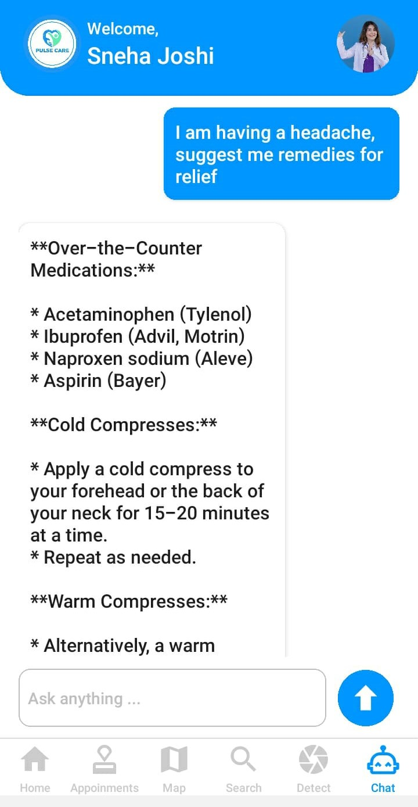
  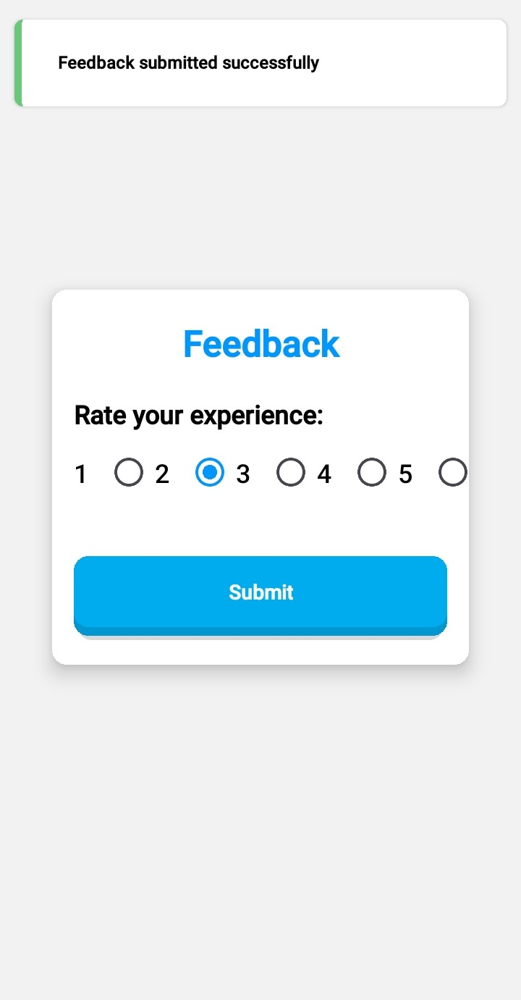

  AI Chat | Feedback

